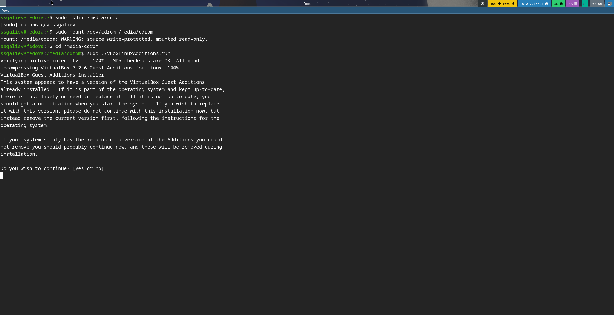
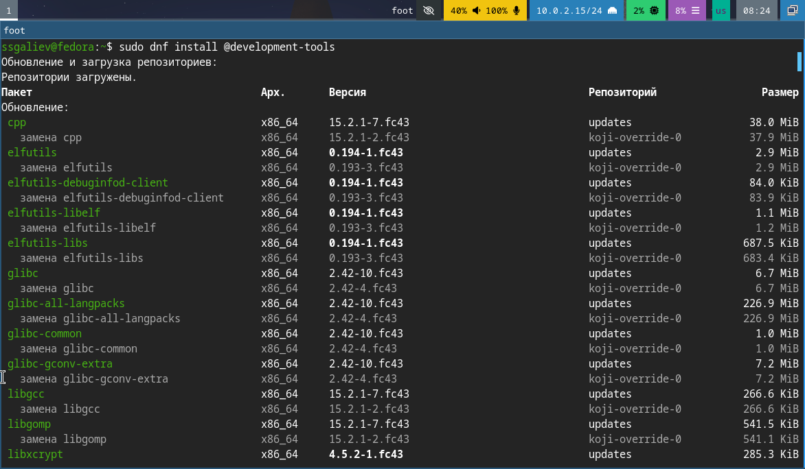

---
## Author
title: "Лабораторная работа 1"
subtitle: "Установка ОС на виртуальную машину"
author: "Галиев Самир Салаватович"
date: "2026"
institution: "Российский университет дружбы народов им. Патриса Лулумбы"
faculty: "ФФМиЕН"
department: "Компьютерные и информационные науки"
subject: "Операционные системы"
group: "НКАбд-02-25"
toc: true
toc-depth: 3
numbersections: true
geometry: margin=2cm
fontsize: 14pt
linestretch: 1.5
pdf-engine: xelatex
---

# Информация

## Докладчик

:::::::::::::: {.columns align=center}
::: {.column width="70%"}

  * Галиев Самир Салаватович
  * студент
  * дисциплина: Архитектура компьютера
  * Российский университет дружбы народов им. П. Лумумбы
  * [1032252590@rudn.ru](mailto:1032252590@rudn.ru)

:::
::: {.column width="30%"}

{width=60%}

:::
::::::::::::::

# Вводная часть

## Актуальность

- Виртуализация — важный навык для IT-специалиста
- Позволяет тестировать ОС без риска для основной системы
- Необходимо уметь настраивать виртуальные машины
- Требуется минимизация усилий при развёртывании среды

## Объект и предмет исследования

- Виртуальная машина как объект исследования
- Операционная система Fedora Linux
- Программное обеспечение для виртуализации (QEMU/VirtualBox)

## Цели и задачи

- Приобрести навыки установки ОС на виртуальную машину
- Настроить минимально необходимые сервисы для работы
- Установить инструменты для работы с документацией

## Материалы и методы

- Виртуальная машина VirtualBox
- Операционная система Fedora Linux
- Пакетный менеджер dnf
- Терминал и консольные утилиты

# Выполнение работы

## Создание виртуальной машины

- Выделена оперативная память: 10240 МБ
- Создан виртуальный диск: 35 ГБ
- Выделено процессоров: 10 ядра
- Видеопамять: 256 МБ
- Включена поддержка EFI и 3D-ускорения

## Установка операционной системы

- Загрузка с установочного носителя
- Выбор языка и раскладки клавиатуры
- Настройка часового пояса
- Создание пользователя с правами администратора
- Установка системы на виртуальный диск

{width=60%}

## Установка дополнений VirtualBox

```bash
sudo mkdir /media/cdrom
sudo mount /dev/cdrom /media/cdrom
cd /media/cdrom
sudo ./VBoxLinuxAdditions.run
```

## Настройка общих папок 
### Доступ к общим папкам 
{width=60%}
Это нужно для того, чтобы был обмен файлами между хостом и ВМ, автоматическое монтирование, полный доступ к папке

## Установка необходимого ПО
{width=60%}

{width=60%}

## Результаты 
{width=60%}

{width=60%}

{width=60%}
{width=60%}

## Выводы
### Приобретённые навыки
::: incremental
- Установка Fedora Linux на виртуальную машину
- Настройка параметров ВМ (память, диск, сеть)
- Установка Guest Additions
- Настройка общих папок
- Установка ПО для разработки
- Базовая настройка ОС
- Сбор информации о системе
:::

## Контрольные вопросы
::: incremental
Что содержит учётная запись пользователя?
Какие команды терминала вы знаете?
Что такое файловая система?
Как посмотреть смонтированные ФС?
Как удалить зависший процесс?
:::

## Рекомендации
::: incremental
Используйте EFI для современных ОС
Выделяйте достаточно памяти (минимум 4 ГБ)
Устанавливайте Guest Additions сразу после установки ОС
Настройте общие папки для удобства работы
Регулярно обновляйте систему
:::

## Итоговый слайд
### Главное сообщение
::: incremental
Виртуализация — базовый навык современного IT-специалиста
Fedora Linux — современный и надёжный дистрибутив
Правильная настройка ВМ экономит время в дальнейшем
:::

## Вопросы?
Контакты:
Email: 1032252590@rudn.ru
GitHub: @Cobalti