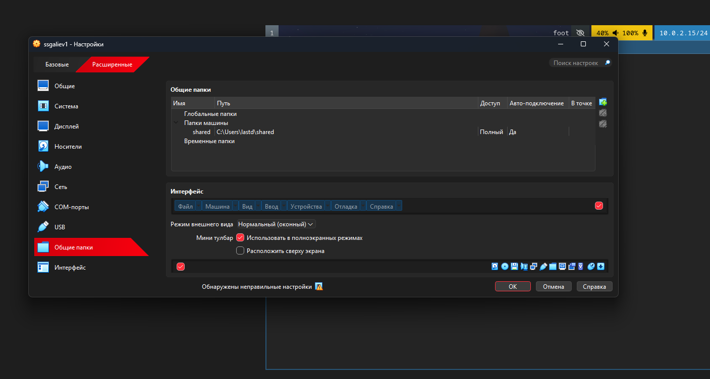
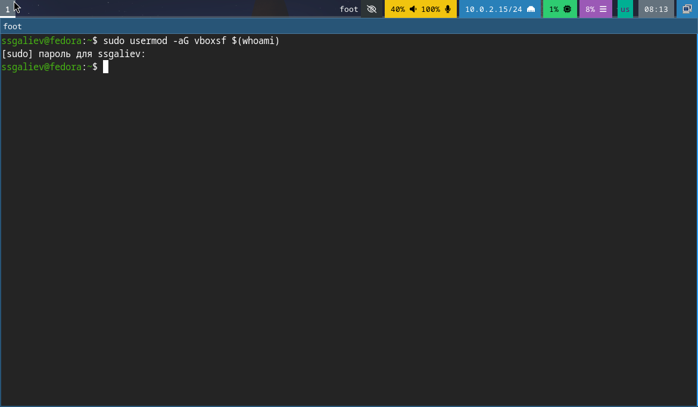
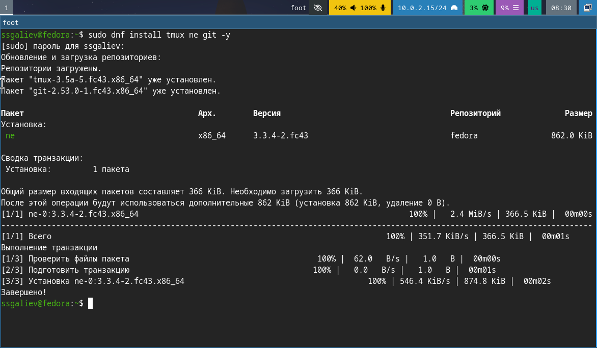
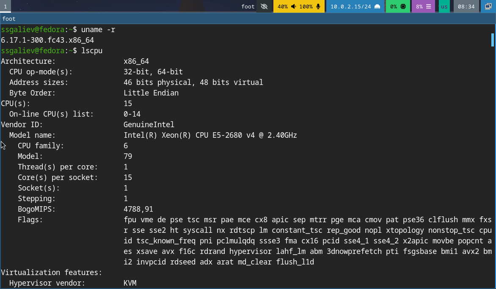
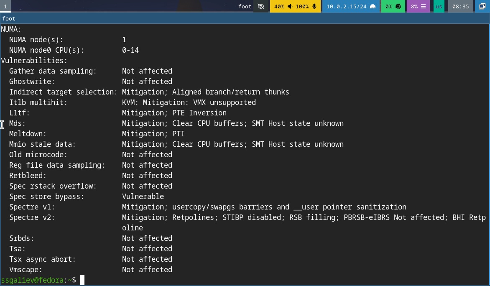
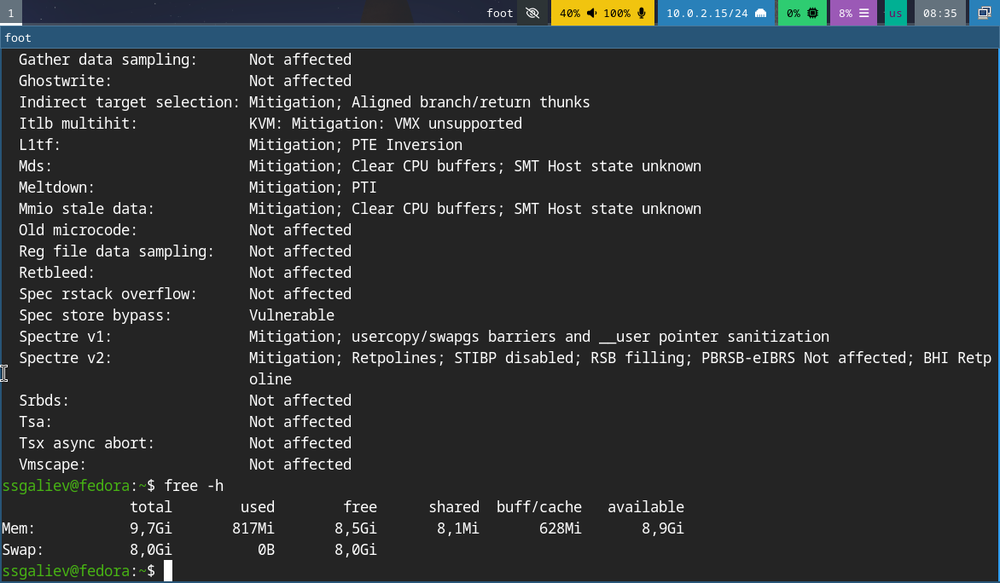
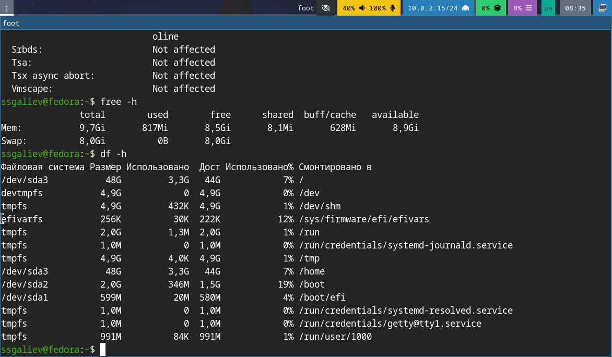

---
## Author
author:
  name: Галиев Самир Салаватович   
  affiliation:
    - name: Российский университет дружбы народов
      country: Российская Федерация
      postal-code: 117198
      city: Москва
      address: ул. Миклухо-Маклая, д. 6
lang: ru
format:
  pdf:
    documentclass: scrartcl
    latex-engine: xelatex
    mainfont: "Liberation Serif"
    sansfont: "Liberation Sans"
    monofont: "Liberation Mono"
    include-in-header:
      text: |
        \usepackage{fontspec}
        \setmainfont{Liberation Serif}
        \setsansfont{Liberation Sans}
        \setmonofont{Liberation Mono}
  pptx:
    toc: false
## Title
title: Лабораторная работа №2
subtitle: Управление версиями
license: CC BY
---

# Содержание 
1) Цель работы
2) Задание
3) Теоретическое введение
4) Выполнение лабораторной работы
5) Выводы 
6) Список литературы pandoc 

---


# Цель работы

Целью данной работы является приобретение практических навыков установки операционной системы на виртуальную машину, настройки минимально необходимых для дальнейшей работы сервисов.

---

# Задание

1. Установка Linux на VirtualBox
2. Установка необходимого ПО
3. Первоначальная настройка ОС для дальнейшей работы
4. Установка инструментов для работы

---

# Теоретическое введение

**VirtualBox** — программа для виртуализации различных операционных систем, разработанная компанией Oracle.

**Fedora** — дистрибутив Linux, который спонсируется компанией Red Hat. Отличается использованием новейших технологий.

---

# Выполнение лабораторной работы

## Шаг 1. Создание виртуальной машины

После того, как я создал виртуальную машину, а именно: выделил ей оперативную память, виртуальный диск, процессоры и видеопамять. Я могу приступать к установке самой федоры на жесткий диск. С помощью команды liveinst я запускаю установку. Ввожу свой ник пользователя в системе, задаю пароль, раскладку клавиатуры (английская), время и т.д. Как только установка завершается и система перезагружается, в этот момент я отключаю оптический диск в "устройства" в окне виртуальной машины, дабы у меня снова не запустилась live версия федоры. Теперь у меня есть полностью настроена для дальнейшей работы ОС.

---

## Шаг 2. Установка дополнений VirtualBox

Для корректной работы виртуальной машины устанавливаю Guest Additions:

```bash
sudo mkdir /media/cdrom
sudo mount /dev/cdrom /media/cdrom
cd /media/cdrom
sudo ./VBoxLinuxAdditions.run
```

---

## Шаг 3. Настройка общих папок
Добавляю пользователя в группу vboxsf для доступа к общим папкам:





---

## Шаг 4. Установка необходимого ПО

Я скачиваю набор необходимых пакетов для работы с ОС:




---

## Шаг 5. Сбор информации о системе





---





---

## Выводы
В ходе выполнения лабораторной работы были приобретены следующие навыки:

1) Установка операционной системы Fedora Sway на виртуальную машину
2) Настройка виртуальной машины
3) Настройка общих папок между хостов и гостевой ОС
4) Установка необходимого программного обеспечения для разработки
5) Базовая настройка операционной системы для дальнейшей работы
9) Сбор информации о системе

---

# Список литературы{.unnumbered}

1) Dash P. Getting Started with Oracle VM VirtualBox. — Packt Publishing Ltd, 2013. — 86 с.
2) Colvin H. VirtualBox: An Ultimate Guide Book on Virtualization with VirtualBox. — CreateSpace Independent Publishing Platform, 2015. — 70 с.
3) Немет Э., Шнайдер Г., Хейн Т.Р., Уэйли Б. Unix и Linux: руководство системного администратора. — 4-е изд. — Вильямс, 2014. — 1312 с.
4) Колесниченко Д.Н. Самоучитель системного администратора Linux. — Санкт-Петербург: БХВ-Петербург, 2011. — 544 с.
5) Официальная документация Fedora. — https://docs.fedoraproject.org/
6) Официальная документация VirtualBox. — https://www.virtualbox.org/manual/