# Оглавление

::: contents
:::


# Цель работы

Изучить идеологию и применение средств контроля версий. Освоить умения по работе с Git.

**Задачи:**
- Изучить системы контроля версий и их назначение
- Освоить основные команды Git
- Научиться настраивать локальный и удалённый репозиторий
- Изучить работу с SSH и PGP ключами
- Научиться подписывать коммиты


# Задание

1. Создать базовую конфигурацию для работы с Git
2. Создать ключ SSH
3. Создать ключ PGP
4. Настроить подписи Git
5. Зарегистрироваться на GitHub
6. Создать локальный каталог для выполнения заданий по предмету


# Теоретическое введение

## Системы контроля версий

**Система контроля версий (Version Control System, VCS)** — это система, применяемая при работе нескольких человек над одним проектом. Обычно основное дерево проекта хранится в локальном или удалённом репозитории, к которому настроен доступ для участников проекта.

При внесении изменений в содержание проекта система контроля версий позволяет:
- Фиксировать изменения
- Совмещать изменения, произведённые разными участниками проекта
- Производить откат к любой более ранней версии проекта

## Классификация VCS

| Тип VCS | Примеры | Особенности |
|---------|---------|-------------|
| Централизованные | CVS, Subversion | Единый центральный репозиторий |
| Распределённые | Git, Bazaar, Mercurial | Каждый участник имеет полную копию репозитория |

## Основные команды Git

```bash
# Инициализация репозитория
git init

# Получение обновлений из центрального репозитория
git pull

# Отправка изменений в центральный репозиторий
git push

# Просмотр списка изменённых файлов
git status

# Просмотр текущих изменений
git diff

# Добавление файлов
git add .

# Сохранение изменений
git commit -am "Описание коммита"

# Создание новой ветки
git checkout -b имя_ветки

# Переключение на ветку
git checkout имя_ветки

# Слияние ветки с текущим деревом
git merge --no-ff имя_ветки
```


# Выполнение лабораторной работы
## Шаг 1. Установка программного обеспечения
1.1 Установка Git

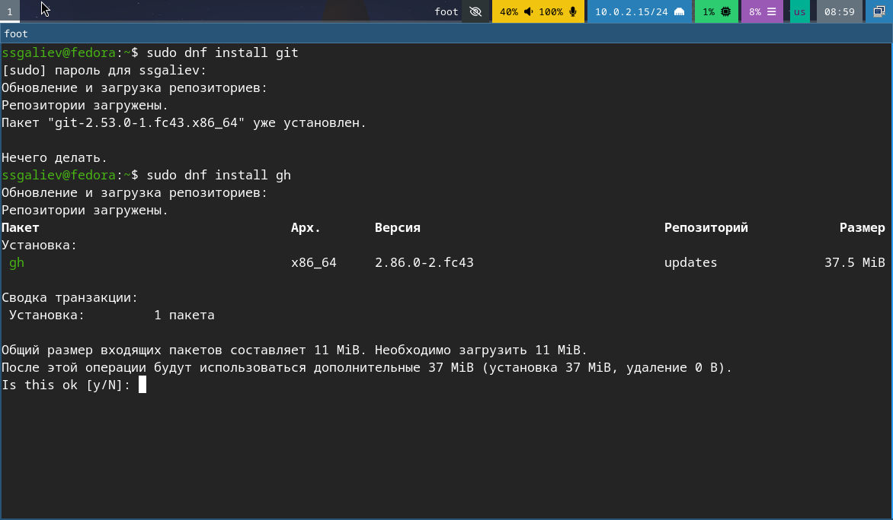{#1 width = 70%}
Установка гит

1.2 Установка GitHub CLI

{#1 width = 70%}
Установка CLI


## Шаг 2. Базовая настройка Git
2.1 Настройка имени, email, кодировки UTF-8, начальной ветки и т.д.

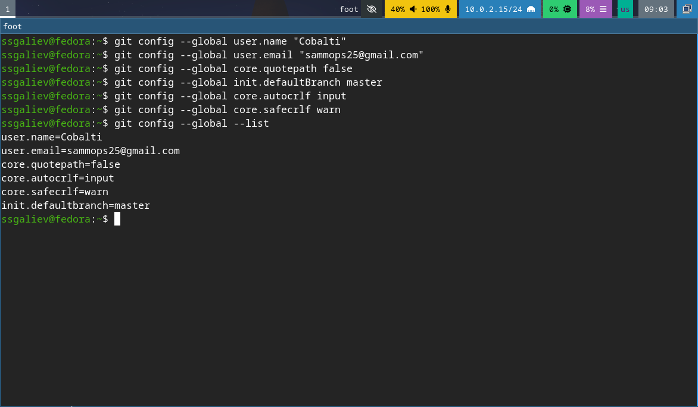{#1 width = 70%}
задаем имя и почту


## Шаг 3. Создаем SSH и PGP ключ(прикрепляем их к гитхабу)
3.1 Генерация RSA ключа

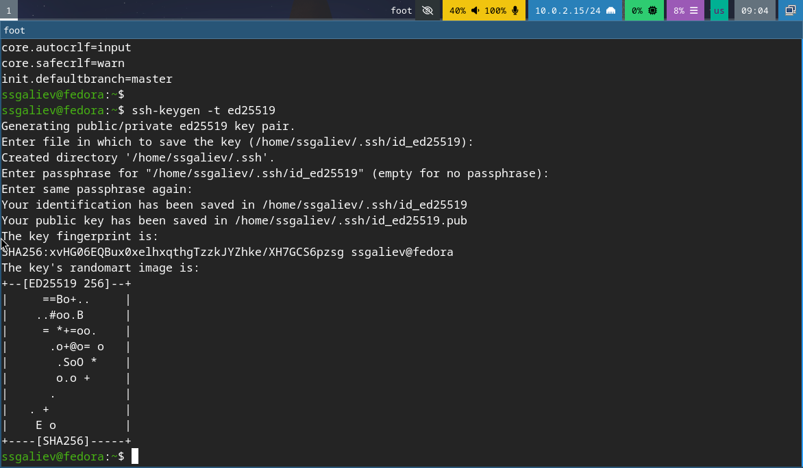{#1 width = 70%}
генерируем ключ

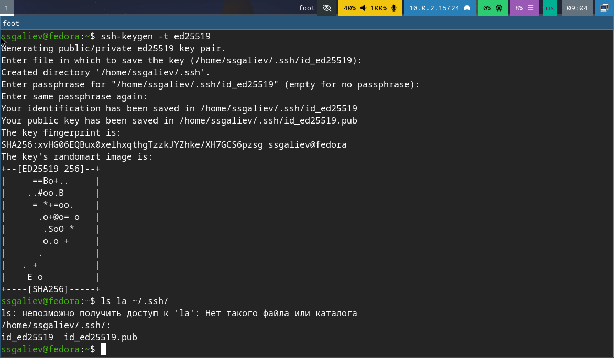{#1 width = 70%}
Генерируем ключ(публичный ключ) и проверка созданных ключей. PGP ключ также создаем и прикрепляем к нашему гиту 

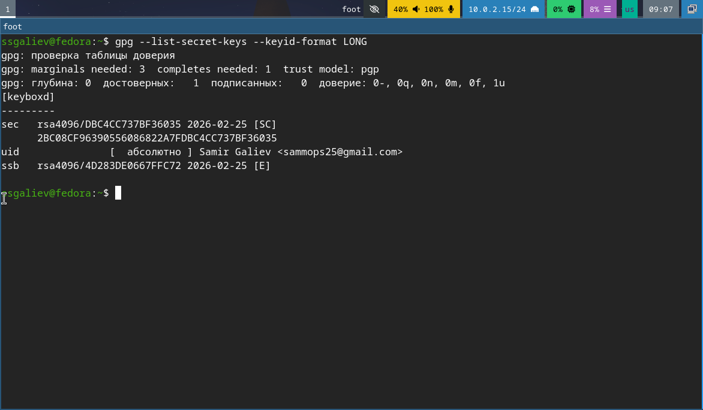{#1 width = 70%}

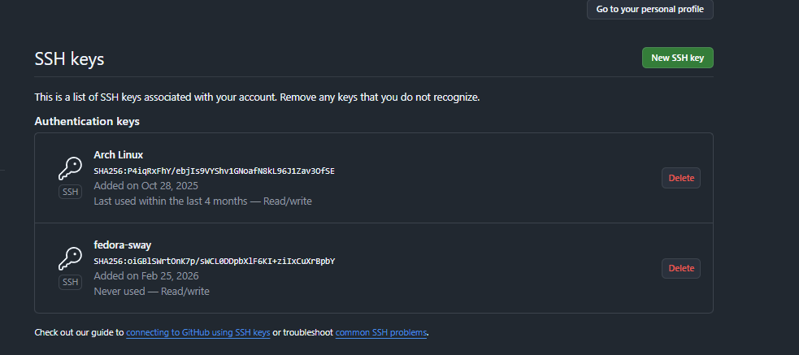{#1 width = 70%}
Прикрепление ssh и pgp ключа к гитхабу

## Шаг 4. Настройка автоматических подписей коммитов

{#1 width = 70%}
Настройка для коммитов

## Шаг 5. Настройка Gihub CLI

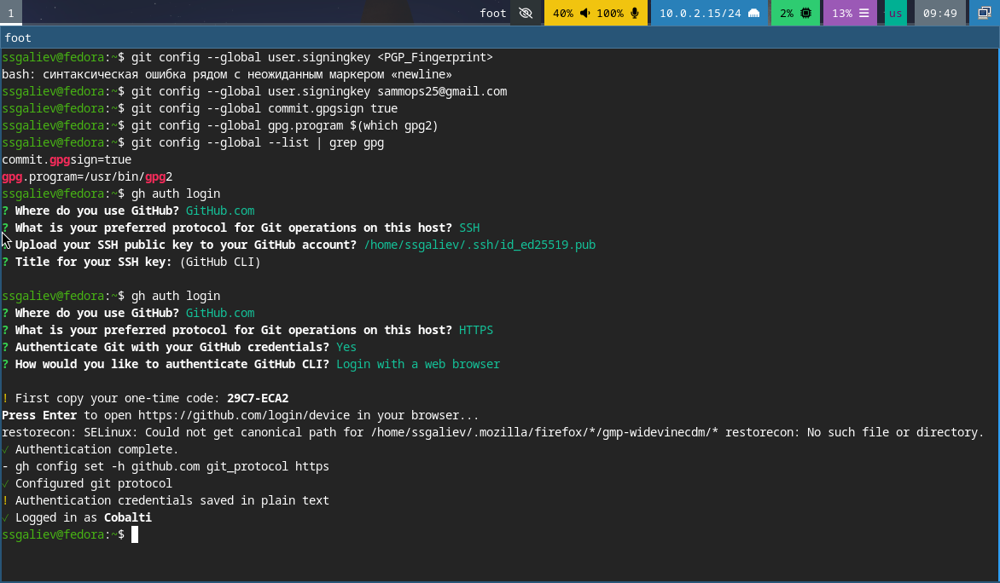{#1 width = 70%}

## Шаг 6. Создание репозитория курса

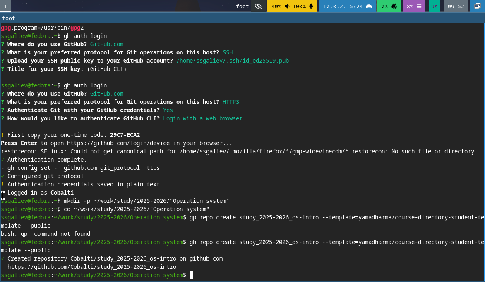{#1 width = 70%}
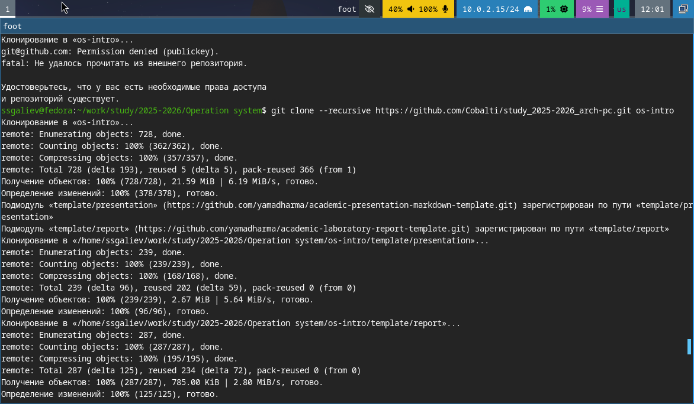{#1 width = 70%}
создание репозитория и его клонирование

## Шаг 7. Настройка каталога курса, удаление лишних файлов, создание каталогов и отправка файлов на сервак

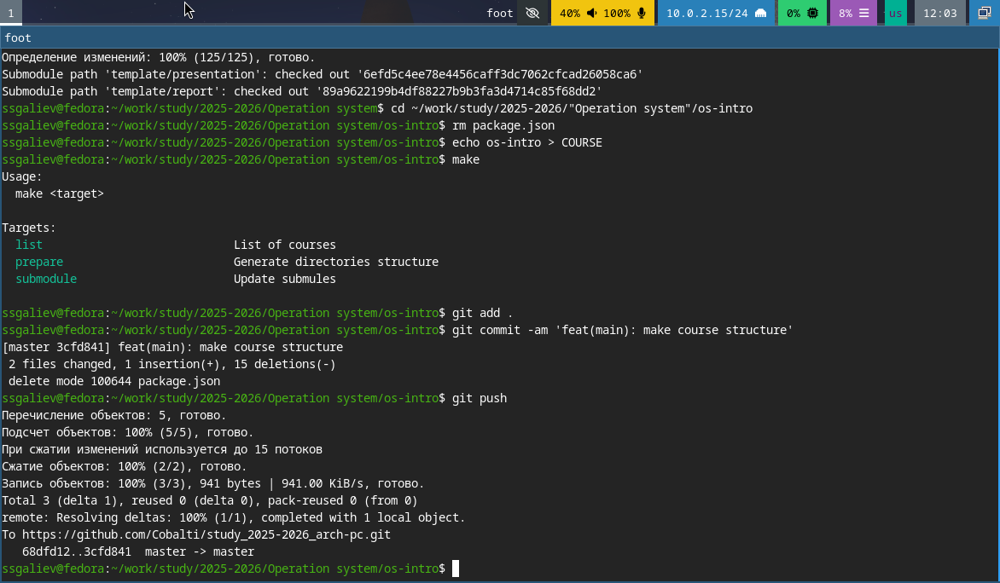{#1 width = 70%}
Переход в каталог курса

## Шаг 8. Проверка подписей коммитов

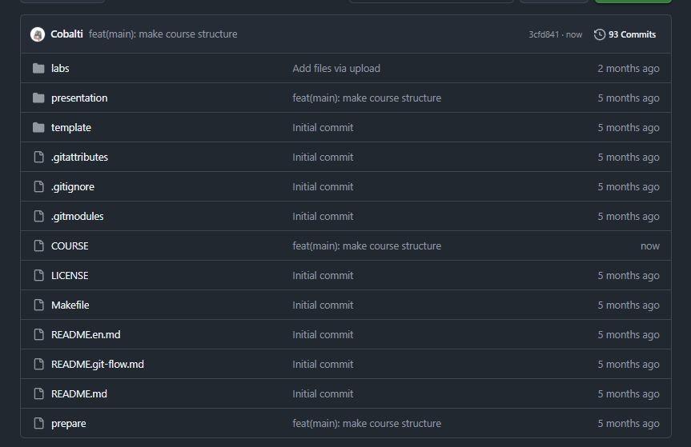
Удостоверямеся что все верно

## Ответы на контрольные вопросы

**1. Что такое система контроля версий?**  
Инструмент для фиксации изменений в файлах, позволяющий отслеживать историю, возвращаться к предыдущим версиям и совмещать правки разных авторов.

**2. Централизованные и распределённые VCS: в чём разница?**  
Централизованные (SVN) хранят историю на одном сервере; распределённые (Git) дают каждому участнику полную копию репозитория, позволяя работать офлайн.

**3. Для чего нужны `git add` и `git commit`?**  
`git add` — добавляет изменения в индекс (подготовка к коммиту); `git commit` — сохраняет изменения в локальную историю с комментарием.

**4. Зачем нужны SSH-ключи в Git?**  
Для безопасной аутентификации при подключении к удалённым репозиториям без ввода логина и пароля.

**5. Чем отличается PGP-подпись коммита?**  
Криптографически подтверждает авторство и целостность коммита; на GitHub такие коммиты помечаются как **Verified**.

**6. Что делает `git config --global`?**  
Записывает настройки в глобальный файл `~/.gitconfig`, применяя их ко всем репозиториям пользователя.

**7. Зачем нужен `core.autocrlf` и какое значение в Linux?**  
Управляет преобразованием символов конца строки. В Linux: `input` — конвертирует CRLF→LF при коммите, не меняет при checkout.

**8. Как проверить подпись коммита?**  
Локально: `git log --show-signature`; на GitHub — значок **Verified** рядом с коммитом.

**9. Что делает `git flow init`?**  
Инициализирует структуру веток Git Flow: создаёт `master`, `develop` и настраивает префиксы для `feature/`, `release/`, `hotfix/`.

**10. Как создать и отправить тег версии?**  
```bash
git tag -a v1.0.0 -m "Release"
git push origin v1.0.0
# или все теги:
git push --tags
```

# Вывод
В ходе выполнения лабораторной работы были достигнуты следующие результаты:
1) Изучения системы контроля версий 
2) Выполнена настройка Гит
3) Создание ключа безопасности
4) Настроена интеграция с GitHub
5) Создание рабочего пространства

Цель работы полностью достигнута.


# Список литературных источников 
1) Официальная документация Git. — URL: https://git-scm.com/doc (дата обращения: 2026)
2) GitHub Docs. — URL: https://docs.github.com (дата обращения: 2026)
3) Проктор Г. Git для профессионалов. — М.: ДМК Пресс, 2021. — 352 с.
4) Чакона С., Штрауб Б. Pro Git. 2-е изд. — М.: Питер, 2020. — 416 с.
5) Семантическое версионирование. — URL: https://semver.org/lang/ru/ (дата обращения: 2026)
6) Conventional Commits. — URL: https://www.conventionalcommits.org (дата обращения: 2026)
7) Pandoc User's Guide. — URL: https://pandoc.org/MANUAL.html (дата обращения: 2026)
8) ГОСТ 7.32-2001. Отчёт о научно-исследовательской работе. Структура и правила оформления.


