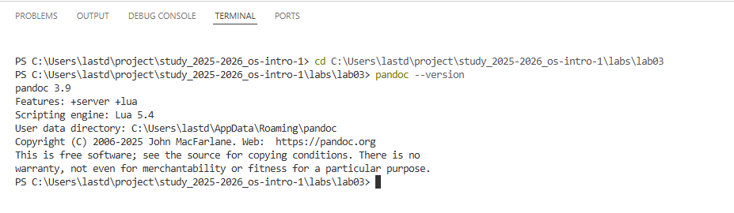
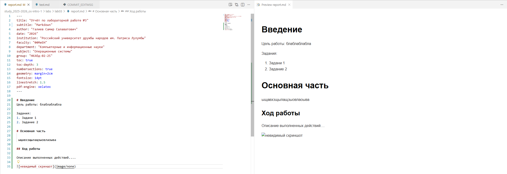
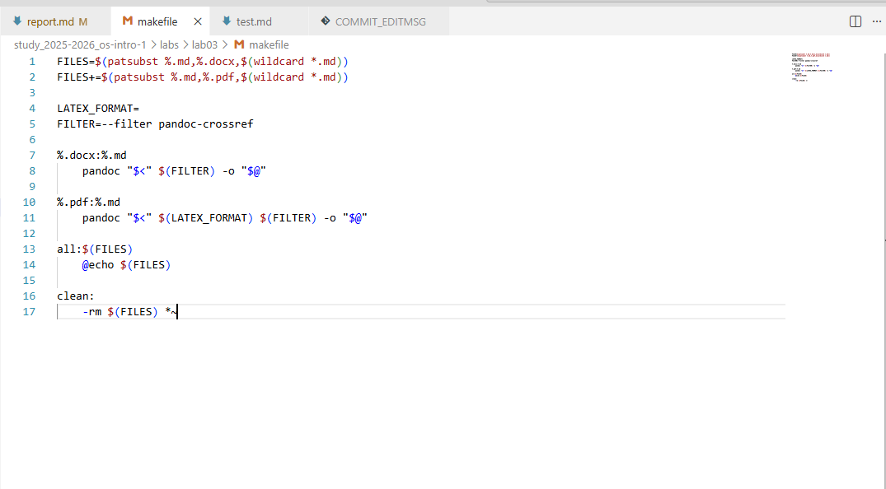
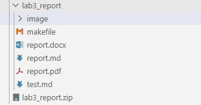
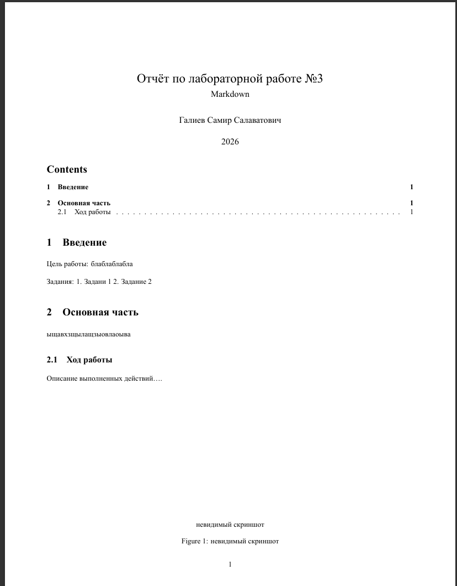

# Оглавление

::: contents
:::

# 1. Цель работы

Научиться оформлять отчёты с помощью легковесного языка разметки Markdown, а также освоить инструменты конвертации документов (Pandoc) и автоматизации сборки (Makefile).

# 2. Задание

1. Сделать отчёт по лабораторной работе в формате Markdown.
2. Предоставить отчёт в 3 форматах: **pdf**, **docx** и **md** (в архиве, содержащем скриншоты, Makefile и исходные файлы).
3. Оформить титульный лист, введение, основную часть, выводы и список литературы согласно ГОСТ 7.32-2001.

# 3. Теоретическое введение

**Markdown** — это облегчённый язык разметки, созданный с целью написания максимально читаемого и удобного для правки текста, который при этом легко преобразуется в языки для продвинутой вёрстки (HTML, LaTeX, PDF, DOCX).

## 3.1. Основные элементы синтаксиса
Согласно методическим указаниям, Markdown поддерживает следующие элементы форматирования:

| Элемент | Синтаксис | Пример |
| :--- | :--- | :--- |
| Заголовки | `#`, `##`, `###` | `# Заголовок 1` |
| Полужирный текст | `**текст**` | `**важно**` |
| Курсив | `*текст*` | `*акцент*` |
| Списки | `-` или `1.` | `- пункт` |
| Ссылки | `[текст](url)` | `[сайт](https://example.com)` |
| Код (inline) | `` `код` `` | `` `print()` `` |
| Блок кода | ` ```язык ` | ` ```python ` |
| Формулы (LaTeX) | `$...$` или `$$...$$` | `$\sin(x)$` |

## 3.2. Инструментарий
Для обработки файлов используется утилита **Pandoc**. Для корректной работы с перекрёстными ссылками и библиографией необходимы фильтры:
- `pandoc-citeproc`
- `pandoc-crossref`

Автоматизация конвертации осуществляется через файл `Makefile`.

# 4. Выполнение лабораторной работы

## 4.1. Подготовка окружения
Была произведена установка программного обеспечения:
1. Установлен Pandoc с официального сайта.
2. Скачаны и настроены фильтры `pandoc-citeproc` и `pandoc-crossref`.
3. Проверена работоспособность через консоль.

> **Рис. 1.** Проверка версии Pandoc в терминале.
>
> 

## 4.2. Создание исходного файла
Был создан файл `report.md`. В нём реализована структура отчёта: титульная информация (через YAML заголовок), разделы, списки, формулы и ссылки на изображения.

> **Рис. 2.** Структура файла report.md в редакторе.
>
> 

## 4.3. Настройка Makefile
Для автоматической конвертации создан файл `Makefile`. Он содержит правила для сборки `.pdf` и `.docx` версий документа с использованием необходимых фильтров.

> **Рис. 3.** Содержимое файла Makefile.
>
> 

## 4.4. Конвертация и сборка
С помощью команды `make all` произведена сборка проекта. В результате были получены файлы `report.pdf` и `report.docx`.

> **Рис. 4.** Результат работы команды make в терминале.
>
> 

> **Рис. 5.** Итоговый PDF документ.
>
> 

# 5. Ответы на контрольные вопросы

**Вопрос 1:** Какие инструменты необходимы для конвертации Markdown в PDF с поддержкой перекрёстных ссылок?
**Ответ:** Для этого необходим Pandoc, а также фильтр `pandoc-crossref`, который подключается через флаг `--filter`.

**Вопрос 2:** Как в Markdown оформить выключную формулу с меткой для ссылки?
**Ответ:** Необходимо использовать конструкцию `$$...$${#eq:label}`, где `label` — уникальный идентификатор формулы. Ссылка на неё ставится как `[-@eq:label]`.

**Вопрос 3:** В каких форматах согласно заданию должен быть предоставлен отчёт?
**Ответ:** Отчёт должен быть предоставлен в трёх форматах: `.md` (исходник), `.pdf` и `.docx`, упакованных в архив вместе со скриншотами и Makefile.

# 6. Вывод

В ходе выполнения лабораторной работы № 3 были освоены навыки работы с языком разметки Markdown. Я научился:
- Использовать базовый синтаксис (заголовки, списки, форматирование текста).
- Вставлять математические формулы и код.
- Настраивать автоматическую конвертацию документов с помощью Pandoc и Makefile.
- Оформлять документацию в соответствии с требованиями ГОСТ (структура отчёта).

Полученные навыки могут быть применены для написания курсовых и дипломных работ, а также для ведения технической документации.

# Список литературы

1. Официальный сайт Pandoc. URL: https://pandoc.org/
2. Репозиторий pandoc-citeproc. URL: https://github.com/jgm/pandoc/releases
3. Репозиторий pandoc-crossref. URL: https://github.com/lierdakil/pandoc-crossref/releases
4. ГОСТ 7.32-2001. Отчёт о научно-исследовательской работе. Структура и правила оформления.
5. Кулябов Д. С. и др. Операционные системы: Методические указания к лабораторным работам.