\pagebreak

::: Оглавление
:::

\pagebreak

# Цель работы

Изучить методологию Git Flow для управления ветками в проектах. Освоить принципы семантического версионирования и общепринятых коммитов (Conventional Commits).

**Задачи:**
- Изучить Git Flow и его основные ветки (master, develop, feature, release, hotfix)
- Освоить семантическое версионирование (SemVer)
- Научиться использовать Conventional Commits
- Настроить инструменты: git-flow, commitizen, standard-changelog
- Создать репозиторий с правильной структурой версионирования

\pagebreak

# Задание

1. Выполнить работу для тестового репозитория
2. Преобразовать рабочий репозиторий в репозиторий с git-flow и conventional commits
3. Установить и настроить git-flow
4. Установить Node.js и необходимые пакеты
5. Настроить общепринятые коммиты (commitizen, standard-changelog)
6. Создать релиз с версией 1.0.0
7. Разработать новую функциональность в feature-ветке
8. Создать релиз с версией 1.2.3

\pagebreak

# Теоретическое введение

## Git Flow

**Git Flow** — это методология управления ветками в Git, которая определяет строгую модель ветвления для проектов.

### Основные ветки Git Flow

| Ветка | Назначение | Описание |
|-------|------------|----------|
| **master** | Продакшн | Содержит только официальные релизы |
| **develop** | Разработка | Основная ветка для разработки |
| **feature** | Новые функции | Создаются от develop для новых функций |
| **release** | Подготовка релиза | Создаются от develop для подготовки релиза |
| **hotfix** | Исправления | Создаются от master для срочных исправлений |

### Жизненный цикл веток

**Feature ветки:**
- Создаются: `git flow feature start feature_name`
- Завершаются: `git flow feature finish feature_name`
- Сливаются с develop

**Release ветки:**
- Создаются: `git flow release start version`
- Завершаются: `git flow release finish version`
- Сливаются с master и develop

**Hotfix ветки:**
- Создаются: `git flow hotfix start hotfix_name`
- Завершаются: `git flow hotfix finish hotfix_name`
- Сливаются с master и develop

## Семантическое версионирование (SemVer)

**Семантическое версионирование** — это стандарт нумерации версий в формате **MAJOR.MINOR.PATCH** (например, 1.2.3).

### Правила увеличения версий

| Компонент | Когда увеличивать | Пример |
|-----------|-------------------|--------|
| **MAJOR** | Несовместимые изменения API | 1.0.0 → 2.0.0 |
| **MINOR** | Новая функциональность (обратно совместимая) | 1.0.0 → 1.1.0 |
| **PATCH** | Исправления ошибок (обратно совместимые) | 1.0.0 → 1.0.1 |

## Conventional Commits

**Conventional Commits** — это спецификация для написания сообщений коммитов.

# Выполнение лабораторной работы 
## Шаг 1. Установка программного обеспечения
1.1 Установка git-flow
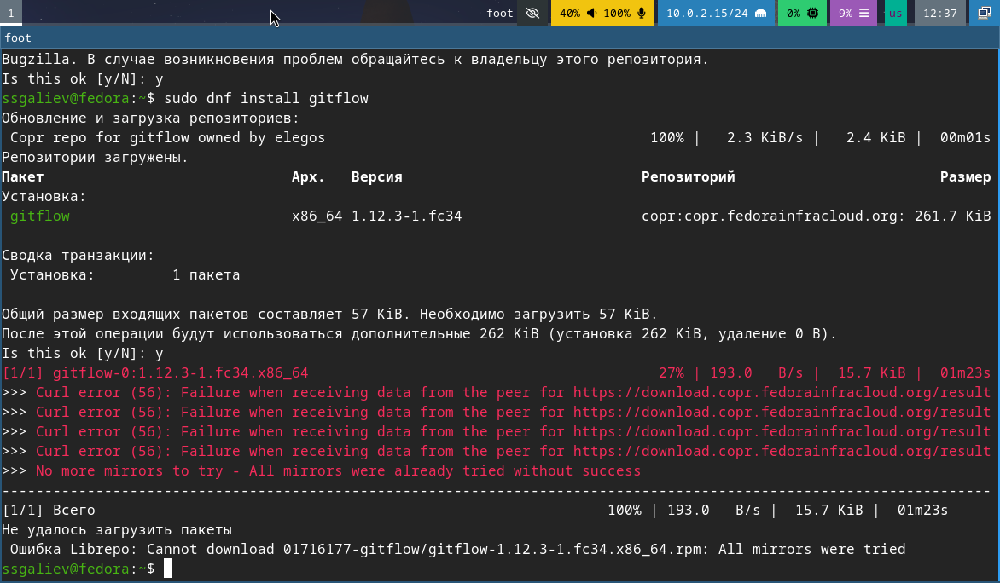{width=70%}
Несмотря на то, что программа выдаал ошибку, в будущем при повторном вводе команды git-flow установился.\

1.2 Установка Node.js
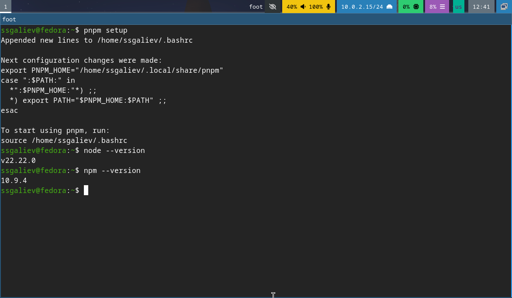{width=70%}
проверям все ли у нас установилось

1.3 Установка commitizen
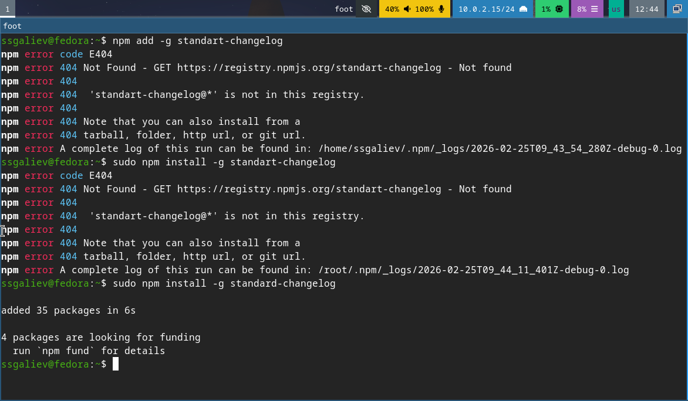{width=70%}

1.4 Установка standart-changelog
{width=70%}
на этом с установкой нужно по мы закончили

## Шаг 2. Создание репозитория в гит
2.1 Создание репозитория в Github
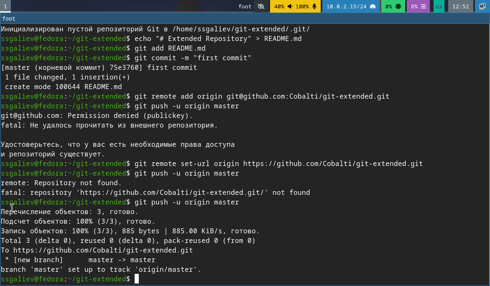{width=70%}
также инициализируем локальный репозиторий

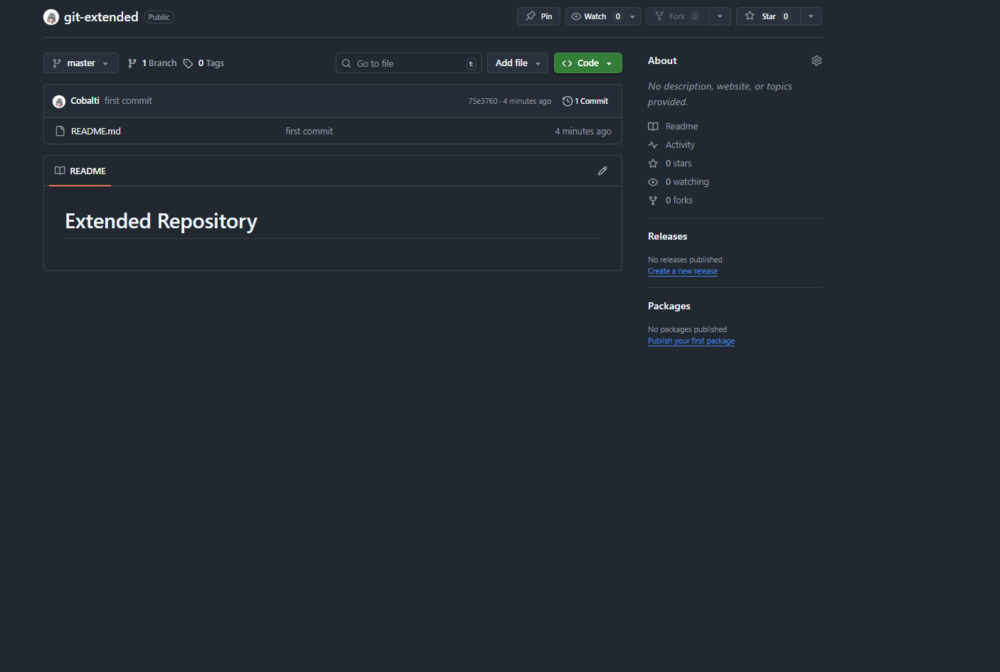{width=70%}
как теперь выглядит наш репозиторий на самом гите
## Шаг 3. Конфигурация общепринятых коммитов
3.1 Инициализация Node.js проекта
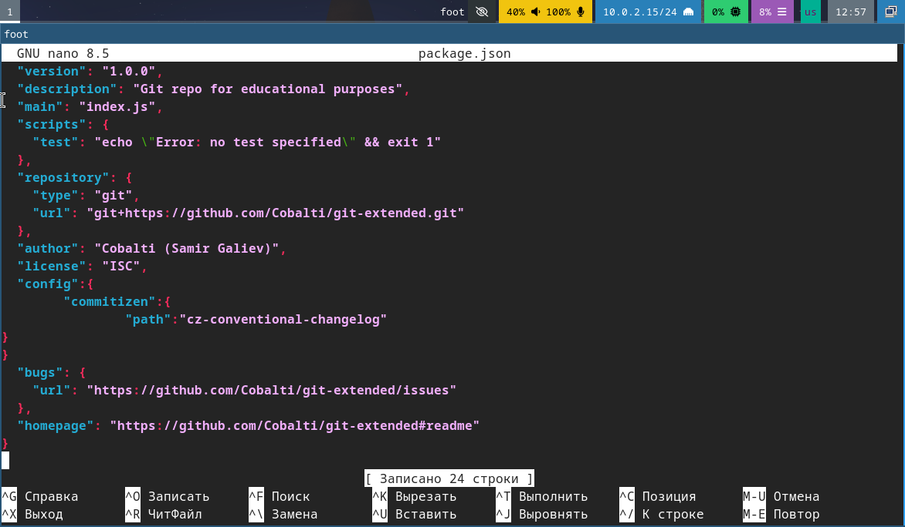{width=70%}
настраиваем commitizen в package.json
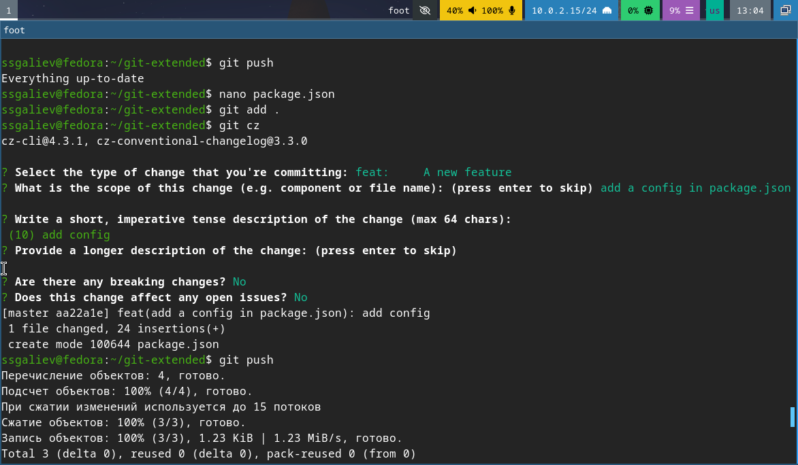{width=70%}
отправляем на гитхаб
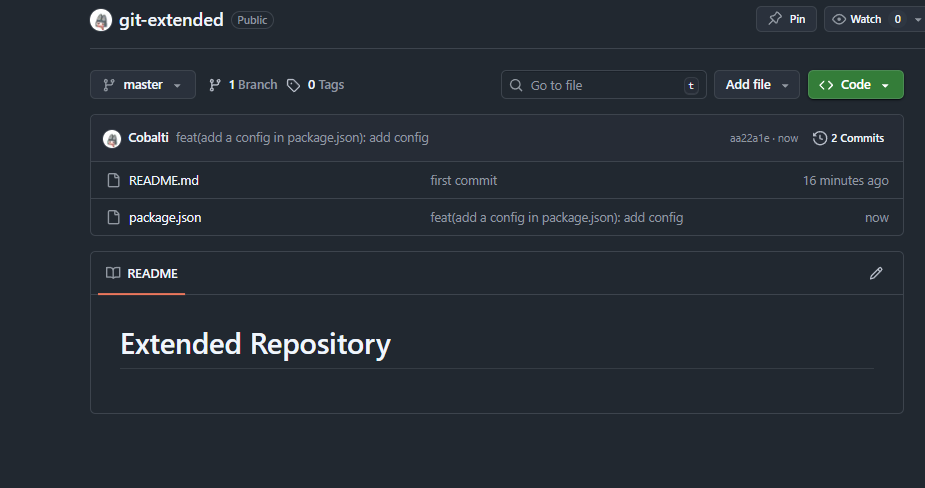{width=70%}
проверяем все ли загрузилось
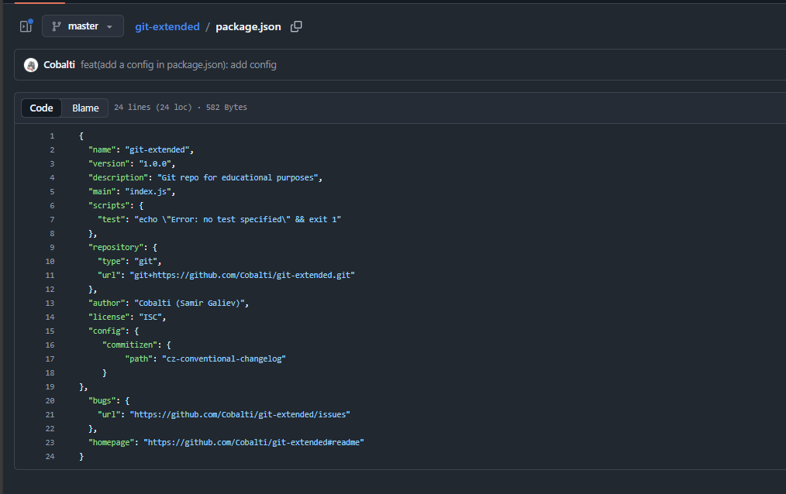{width=70%}

## Шаг 4. Инициализация git-flow
4.1 Инциализация git-folw
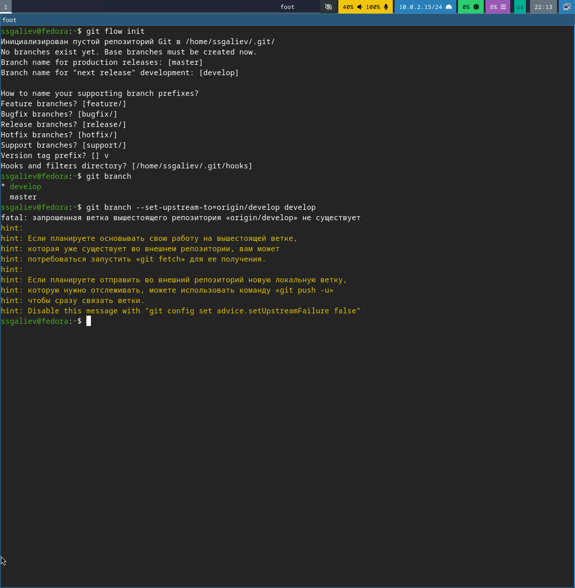{width=70%}
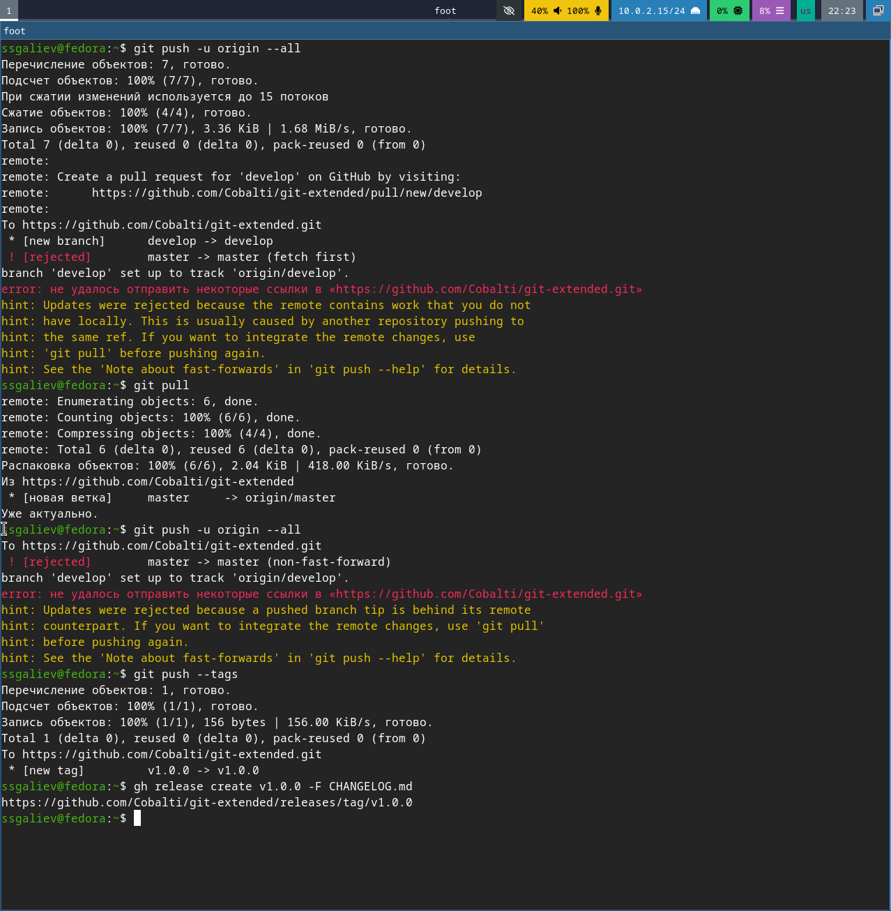{width=70%}
все проверяем и отправляем в наш гит
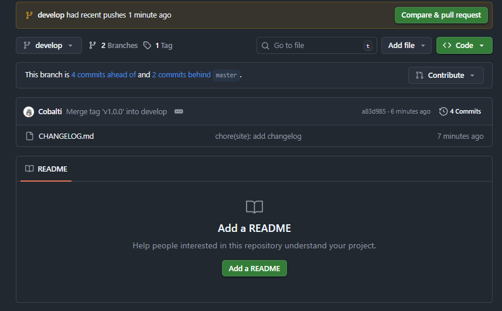{width=70%}
как видим, все получилось
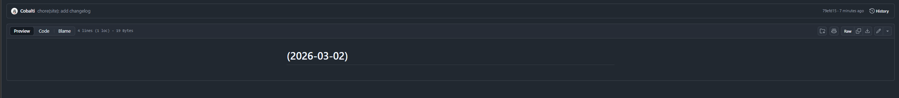{width=70%}

## Шаг 5. Создание первого релиза
5.1 Создание release ветки
{width=70%}
добавляем CHANGELOG и завершаем релиз. Также отправляем на гитхаб.
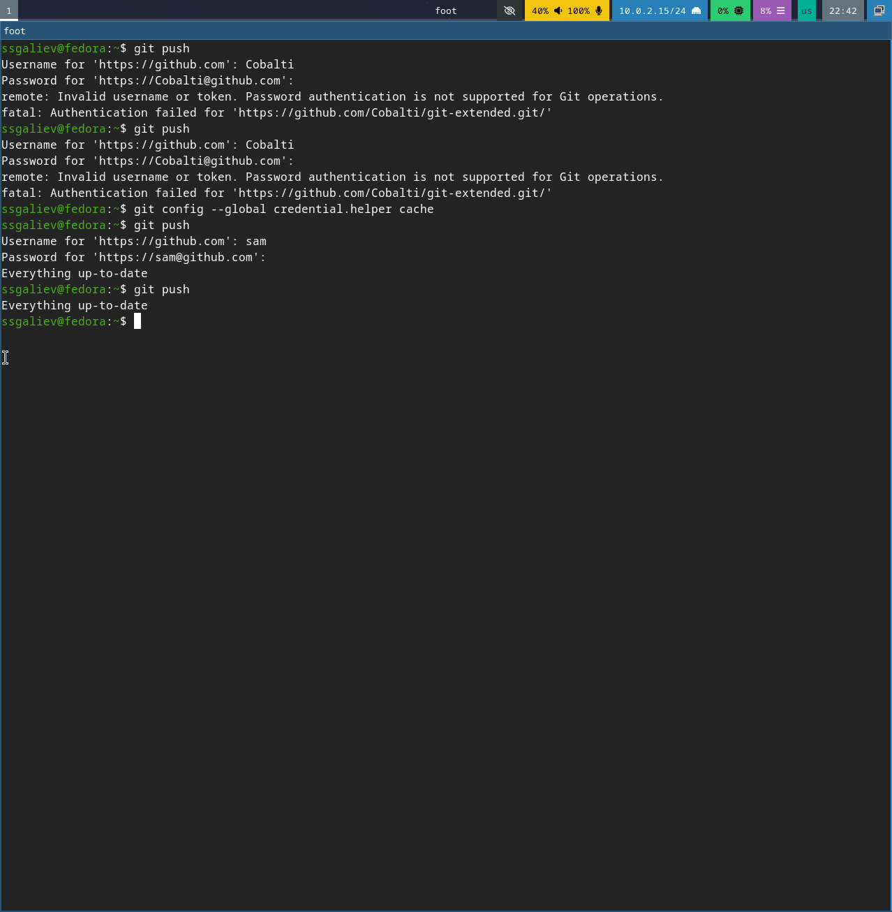{width=70%}
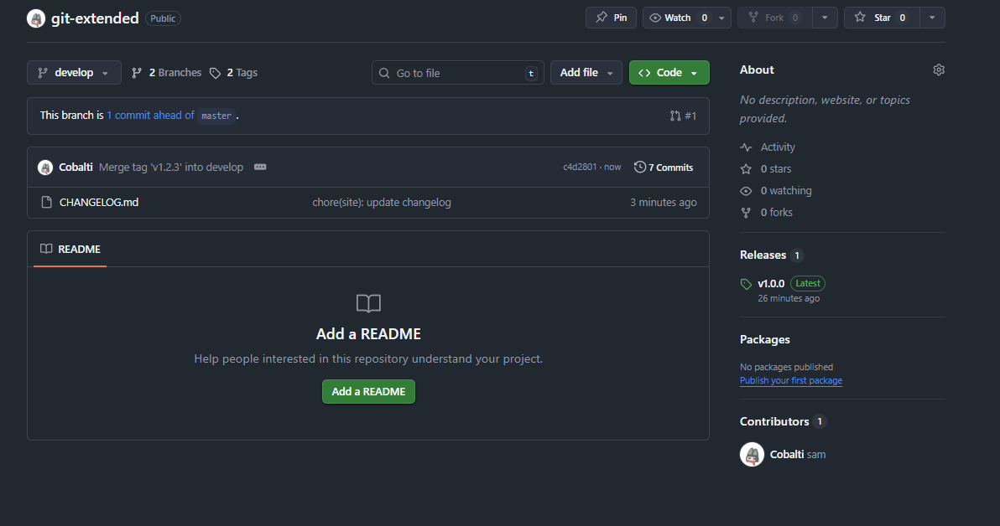{width=70%}
наш релиз v1.0.0

## Шаг 6. Создание релиза v1.2.3
{width=70%}
мы также создаем CHANGELOG, завершаем наш релиз и отправыляем на гитхаб.
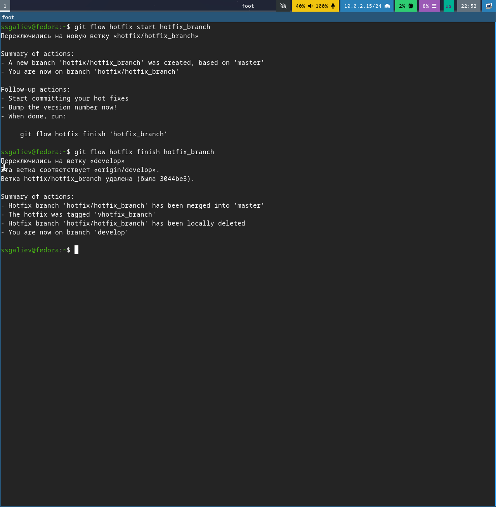{width=70%}

# Вывод 
В хожде выполнения лабораторной работы были достигнуты следующие цели:
1) Изучение метода Git Flow
2) Освоение семантическое версионирование 
3) Внедрение Conventional Commits
4) Настроены инструменты 
5) Настроены репозитории

# Список литературы
1) Git Flow. — URL: https://github.com/nvie/gitflow (дата обращения: 2026)
2) Semantic Versioning 2.0.0. — URL: https://semver.org/lang/ru/ (дата обращения: 2026)
3) Conventional Commits. — URL: https://www.conventionalcommits.org (дата обращения: 2026)
4) Commitizen. — URL: https://github.com/commitizen/cz-cli (дата обращения: 2026)
5) Conventional Changelog. — URL: https://github.com/conventional-changelog/conventional-changelog (дата обращения: 2026)
6) GitHub CLI Manual. — URL: https://cli.github.com/manual/ (дата обращения: 2026)
7) Node.js Documentation. — URL: https://nodejs.org/docs (дата обращения: 2026)
8) ГОСТ 7.32-2001. Отчёт о научно-исследовательской работе. Структура и правила оформления.
