\pagebreak

::: Оглавление
:::

\pagebreak

# Цель работы

Изучить принципы работы менеджера паролей pass и системы управления конфигурационными файлами chezmoi. Освоить методы безопасного хранения паролей с использованием GPG и автоматизации управления dotfiles.

**Задачи:**
- Изучить архитектуру менеджера паролей pass
- Освоить работу с GPG ключами
- Настроить хранилище паролей с синхронизацией через git
- Изучить принципы работы chezmoi для управления конфигурационными файлами
- Освоить создание и использование шаблонов в chezmoi
- Настроить автоматизацию конфигурации на нескольких машинах

\pagebreak

# Задание

## Часть 1. Менеджер паролей pass
1. Установить pass и необходимые зависимости
2. Сгенерировать GPG ключ
3. Инициализировать хранилище паролей
4. Настроить синхронизацию с git
5. Добавить, просмотреть и сгенерировать пароли
6. Настроить интеграцию с браузером

## Часть 2. Управление файлами конфигурации
1. Установить chezmoi и дополнительное ПО
2. Создать репозиторий для dotfiles
3. Инициализировать chezmoi
4. Настроить конфигурацию для нескольких машин

## Часть 3. Шаблоны
1. Изучить синтаксис шаблонов Go
2. Создать шаблоны конфигурационных файлов
3. Протестировать шаблоны
4. Применить шаблоны к реальным файлам

\pagebreak

# Теоретическое введение

## Менеджер паролей pass

**pass** — стандартный менеджер паролей для Unix-систем, использующий файловую систему для хранения и GPG для шифрования.

### Основные свойства

| Свойство | Описание |
|----------|----------|
| **Хранение** | Данные хранятся в файловой системе в виде каталогов и файлов |
| **Шифрование** | Файлы шифруются с помощью GPG-ключа |
| **Структура** | Произвольная иерархия каталогов |
| **Синхронизация** | Через git-репозиторий |

### Семантическая структура базы паролей

Примеры именования файлов:
- `example.com.gpg` — пароль для хоста
- `example.com/user.gpg` — пароль для пользователя на хосте
- `user@example.com.gpg` — альтернативный формат
- `example.com:22.gpg` — пароль с указанием порта

## GPG (GNU Privacy Guard)

**GPG** — программа для шифрования данных и создания электронных подписей.

### Основные команды

| Команда | Назначение |
|---------|------------|
| `gpg --list-secret-keys` | Просмотр секретных ключей |
| `gpg --full-generate-key` | Создание нового ключа |
| `gpg --list-keys` | Просмотр публичных ключей |

## Chezmoi

**chezmoi** — инструмент для управления конфигурационными файлами (dotfiles) на нескольких компьютерах.

### Основные возможности

| Возможность | Описание |
|-------------|----------|
| **Синхронизация** | Хранение конфигурации в git-репозитории |
| **Шаблоны** | Использование синтаксиса Go templates |
| **Machine-specific** | Различные настройки для разных машин |
| **Автоматизация** | Применение конфигурации одной командой |

### Рабочие файлы chezmoi

| Файл/Каталог | Назначение |
|--------------|------------|
| `~/.local/share/chezmoi` | Исходный каталог (клон репозитория) |
| `~/.config/chezmoi/chezmoi.toml` | Конфигурационный файл |
| `.chezmoitemplates/` | Каталог для шаблонов |

### Синтаксис шаблонов

Шаблонизатор использует синтаксис Go templates:

```go
{{ .chezmoi.hostname }}     — имя хоста
{{ .chezmoi.os }}           — операционная система
{{ .chezmoi.arch }}         — архитектура
{{ .chezmoi.username }}     — имя пользователя
```

# Выполнение лабораторной работы
## Шаг 1. Установка программного обеспечения
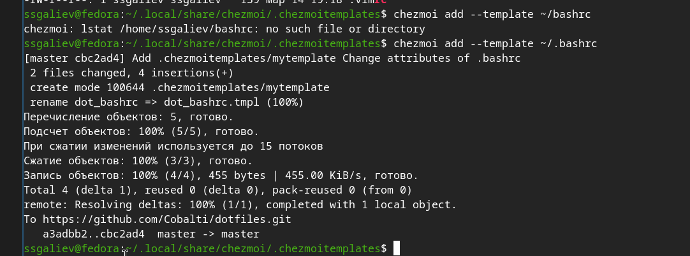{width=70%}
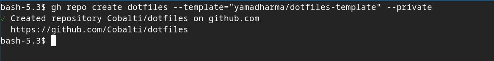{width=70%}
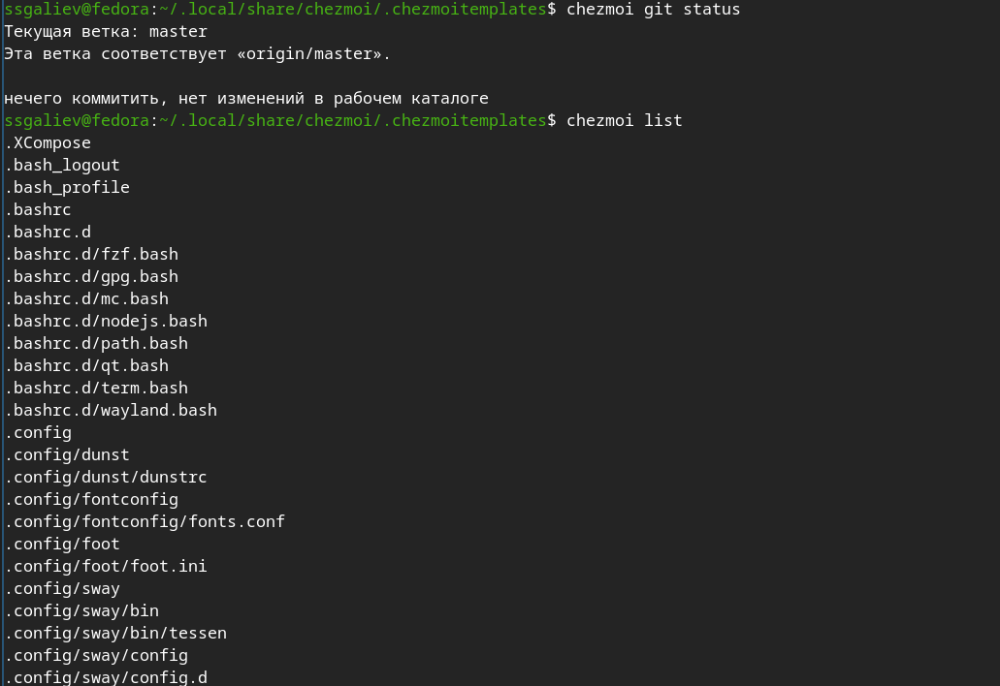{width=70%}
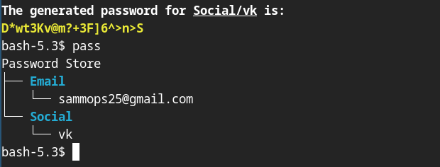{width=70%}
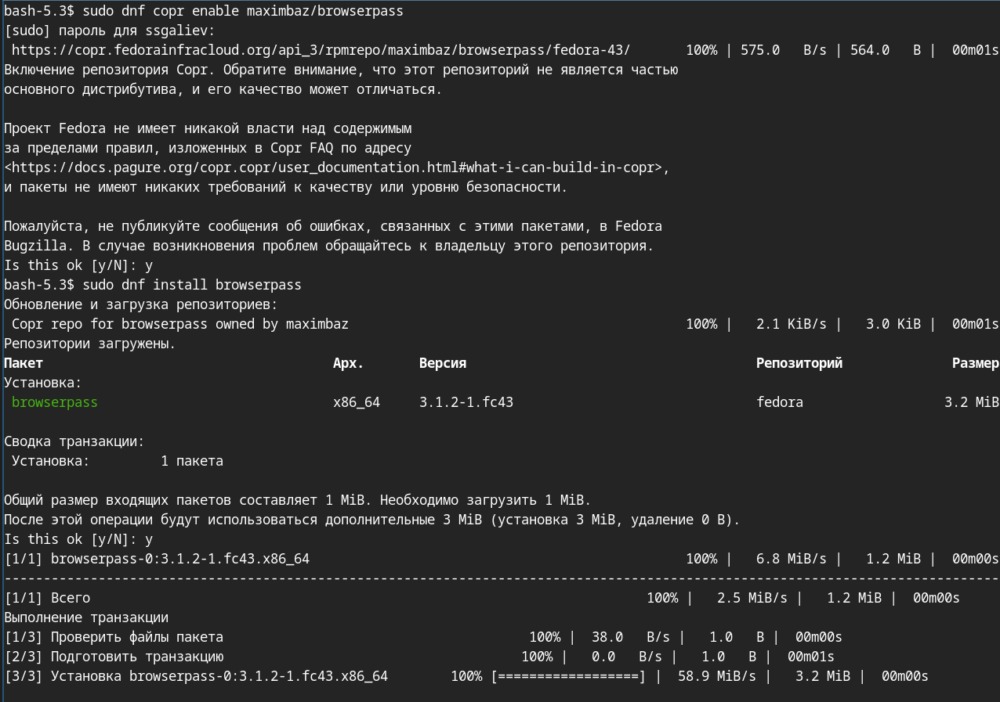{width=70%}
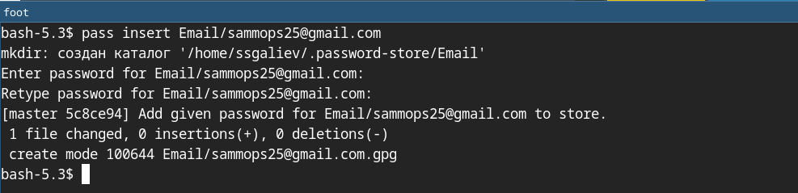{width=70%}
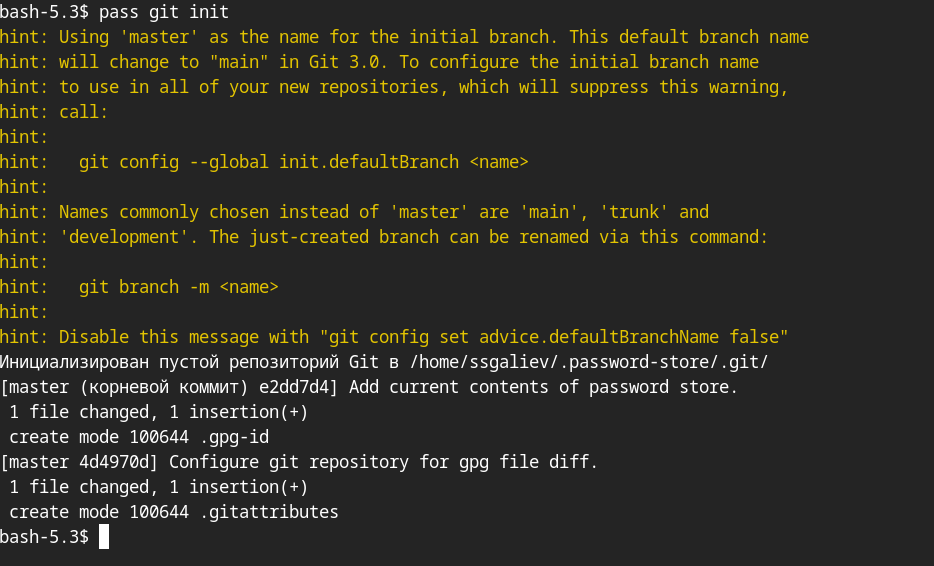{width=70%}
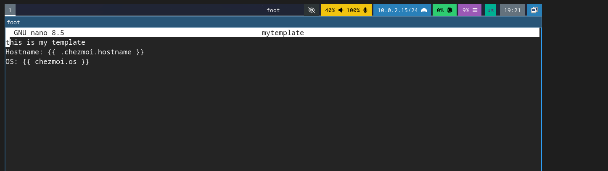{width=70%}
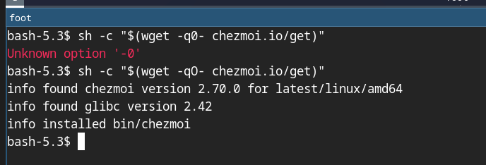{width=70%}
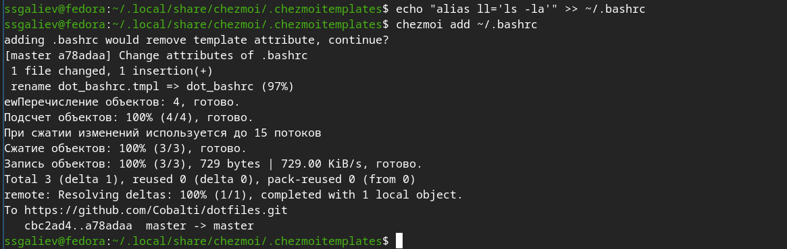{width=70%}
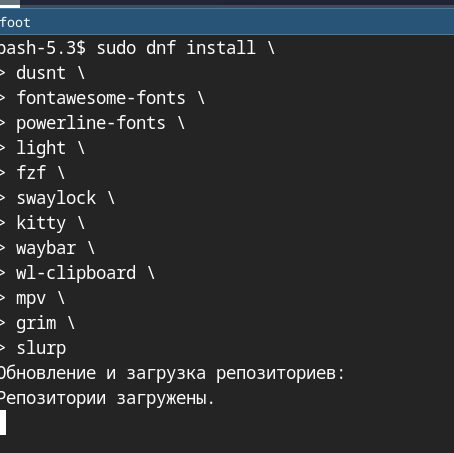{width=70%}
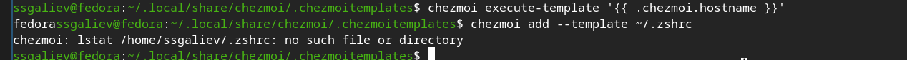{width=70%}
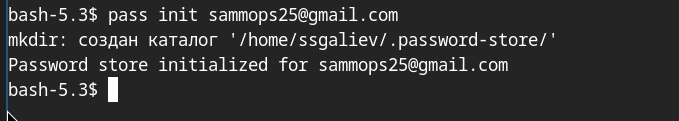{width=70%}

# Вывод
В ходе выполнения лабораторной работы были достигнуты следующие цели:
- Изучен менеджер паролей pass:
- Освоены принципы работы с GPG-шифрованием
- Настроено хранилище паролей с иерархической структурой
- Реализована синхронизация через git
- Научились генерировать и управлять паролями
-Освоена система управления конфигурацией chezmoi:
- Установлен и настроен chezmoi
- Создан репозиторий для хранения dotfiles
- Изучены принципы работы с шаблонами
- Научились применять конфигурацию на разных машинах
Изучены шаблоны Go:
- Освоен синтаксис шаблонизатора
- Созданы условные конструкции для разных ОС
- Реализованы machine-specific конфигурации
- Приобретены практические навыки:
- Безопасное хранение чувствительных данных
- Автоматизация настройки рабочего окружения
- Версионирование конфигурационных файлов
- Синхронизация настроек между устройствами
Практическая значимость: полученные знания позволяют эффективно управлять конфигурацией рабочих систем, обеспечивать безопасность паролей и быстро разворачивать рабочее окружение на новых машинах.
\pagebreak

Список литературы
- Password Store — pass. — URL: https://www.passwordstore.org/ (дата обращения: 2026)
- GnuPG Documentation. — URL: https://www.gnupg.org/documentation/ (дата обращения: 2026)
- Chezmoi Documentation. — URL: https://www.chezmoi.io/ (дата обращения: 2026)
- Go Templates. — URL: https://pkg.go.dev/text/template (дата обращения: 2026)
- GitHub CLI Manual. — URL: https://cli.github.com/manual/ (дата обращения: 2026)
- Git Documentation. — URL: https://git-scm.com/doc (дата обращения: 2026)
- Fedora Documentation. — URL: https://docs.fedoraproject.org/ (дата обращения: 2026)
- ГОСТ 7.32-2001. Отчёт о научно-исследовательской работе. Структура и правила оформления.
